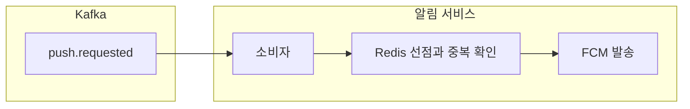

[앞 글](/posts/notification-outbox-relay)에서는 마냑의 스토리 완성 알림을 서버 아웃박스에서 Kafka로 옮겼고 브로커 장애 실험에서 같은 `messageId`가 두 번 발행되는 결과를 확인했다. 마냑은 사용자가 설정을 넣으면 AI가 스토리를 만들고 그 스토리 속 인물과 채팅하는 서비스다.

Kafka는 같은 메시지를 다시 줄 수 있으므로 알림 서비스는 재전달을 정상 입력으로 받아야 한다. 파티션과 오프셋 그리고 리밸런스의 동작은 [앞선 CLI 실습 글](/posts/kafka-cli-partition-offset-rebalance)에서 확인했다. 이번에는 소비 결과를 세 가지로 나누고 Redis에 메시지와 기기별 성공을 기록해 FCM 중복 발송을 막았다.

Kafka에서 알림 서비스까지의 경로는 다음과 같다.



확인한 환경은 Java 21, Kotlin 2.2.21, Spring Boot 4.0.6, spring-kafka 4.0.5, Redis 7이다. 로컬 브로커는 `apache/kafka:4.3.1` 이미지의 KRaft 단일 노드를 썼다.

## 소비 결과를 세 가지로 나누기

알림 서비스는 메시지마다 `SUCCESS`, `DISCARD`, `RETRY` 중 하나를 고른다. `SUCCESS`는 발송을 마쳤다는 뜻이고 `DISCARD`는 수신 거부, 만료, FCM 400류처럼 다시 시도할 필요가 없는 결과다. `RETRY`는 서버 자격 조회 실패와 FCM 일시 오류, 429처럼 시간이 지나면 달라질 수 있는 결과다.

판정과 Redis 상태 전이를 담당하는 부분만 줄이면 다음과 같다.

```kotlin
                    val response = service.send(
                        message.request(),
                        alreadySent = { store.wasSent(message.messageId, it) },
                        onSent = { store.recordSent(message.messageId, owner, it) },
                        beforeSend = { check(System.nanoTime() < deadline) { "Notification processing budget exhausted" } },
                    )
                    val outcome = when {
                        response.retryable > 0 || response.reason == "ELIGIBILITY_UNAVAILABLE" -> ConsumeResult.RETRY
                        response.outcome == NotificationOutcome.SENT -> ConsumeResult.SUCCESS
                        else -> ConsumeResult.DISCARD
                    }
                    log.info("큐 알림 처리 결과 (messageId={}, result={}, reason={})", message.messageId, outcome, response.reason)
                    if (outcome == ConsumeResult.RETRY) store.release(message.messageId, owner)
                    else store.complete(message.messageId, owner)
```

Kafka 자동 커밋은 끄고 레코드 단위 확인을 쓴다. `SUCCESS`와 `DISCARD`는 현재 레코드를 끝낸다. `RETRY`는 예외로 바뀌어 재시도 토픽에 발행되고 그 발행이 확인된 뒤 원본 오프셋을 넘긴다. 재시도 토픽 발행 자체가 실패하면 원본 오프셋을 넘기지 않도록 설정했다.

기기가 둘일 때 한쪽만 발송에 성공하는 경우도 있었다. 처음에는 이를 `SUCCESS`로 끝내려 했지만 그러면 실패한 기기는 다시 받을 기회가 없다. `RETRY`로 돌리면 이번에는 성공했던 기기에 같은 알림이 또 간다. 메시지 전체의 처리 상태와 기기별 발송 상태를 따로 기록해야 했다.

## Redis로 메시지와 기기 발송을 따로 기억하기

알림 서비스에는 DB가 없어서 멱등 저장소로 Redis를 골랐다. `notification:processed:{messageId}`에 `SET NX`로 소유자 값을 넣고 2분 동안 처리 권한을 얻는다. 값이 이미 `done`이면 전에 끝낸 메시지라 바로 성공 처리하고 다른 소유자 값이 있으면 `RETRY`로 돌린다.

```kotlin
    override fun claim(messageId: String, owner: String): Claim {
        if (redis.opsForValue().setIfAbsent(processedKey(messageId), owner, Duration.ofMillis(timing.processingTtlMs)) == true) return Claim.ACQUIRED
        return if (redis.opsForValue().get(processedKey(messageId)) == DONE) Claim.DONE else Claim.BUSY
    }
```

처리가 끝나면 값을 `done`으로 바꾸고 7일 뒤 지운다. 해제와 완료는 Lua 스크립트에서 현재 값이 내 소유자 ID와 같은지 먼저 비교한다. 2분이 지나 다른 소비자가 선점한 뒤 이전 소비자가 늦게 끝나도 새 선점을 지우지 못한다. 7일 보관도 별도 삭제 작업 없이 Redis 유효시간으로 끝난다.

기기별 성공은 `notification:sent:{messageId}` 집합에 토큰의 SHA-256만 넣고 7일 보관한다. 재전달을 받으면 이미 성공한 토큰은 건너뛰고 실패한 토큰만 다시 보낸다.

```kotlin
    override fun wasSent(messageId: String, token: String): Boolean =
        redis.opsForSet().isMember(sentKey(messageId), hash(token)) == true

    override fun recordSent(messageId: String, owner: String, token: String) {
        check(redis.execute(SENT, listOf(processedKey(messageId), sentKey(messageId)), owner, hash(token), HISTORY_TTL.seconds.toString()) == 1L) {
            "Notification processing lease lost"
        }
    }
```

운영 Redis는 메모리가 차면 유효시간이 있는 키가 먼저 지워질 수 있다. 이 경우 7일 안의 메시지도 드물게 다시 발송될 수 있다. 영구 보관을 위해 DB를 추가하지 않고 유실보다 드문 중복을 허용했다.

## 재시도 토픽과 DLQ

실패한 메시지를 원래 파티션에서 60초씩 붙잡으면 뒤에 들어온 다른 메시지도 읽지 못한다. `@RetryableTopic`으로 실패 메시지를 `push.requested.retry`에 옮기고 원본 파티션의 다음 메시지를 처리하게 했다. 최초 시도를 포함해 60초 고정 간격으로 5회 시도하고 끝까지 실패하면 `push.requested.dlq`로 보낸다.

```kotlin
    @RetryableTopic(
        attempts = "\${manyak.push.consumer.retry-attempts:5}",
        backOff = BackOff(delayString = "\${manyak.push.consumer.retry-delay-ms:60000}"),
        retryTopicSuffix = ".retry", dltTopicSuffix = ".dlq",
        sameIntervalTopicReuseStrategy = SameIntervalTopicReuseStrategy.SINGLE_TOPIC,
        autoCreateTopics = "false", kafkaTemplate = "kafkaTemplate",
        include = [RetryMessageException::class],
    )
    @KafkaListener(topics = ["push.requested"], groupId = "notification")
    fun receive(payload: ByteArray) {
        // 원본 바이트를 소비/재발행해 JSON 오류도 내용 손실 없이 곧장 DLQ에 남긴다.
        val message = mapper.readValue(payload, PushMessage::class.java).also { it.validate() }
        if (consumer.onMessage(message) == ConsumeResult.RETRY) throw RetryMessageException()
    }
```

고정 간격은 운영 SQS의 가시성 60초와 최대 수신 5회에 포기 시점을 맞춘 값이다. 간격을 늘리려면 기다리는 시간이 다른 메시지가 한 재시도 토픽 안에서 서로 막지 않도록 간격마다 토픽을 따로 둬야 한다. 10초 간격 3회로 잡으면 2분짜리 서버 장애에서도 30초 만에 모두 DLQ로 간다.

## 처리 중 유효시간이 재시도보다 길었던 문제

처음 구현한 Redis 처리 중 유효시간은 15분이었다. 소비자가 선점한 직후 죽으면 같은 메시지는 약 4분 동안 네 번 다시 전달된다. 하지만 Redis에는 계속 처리 중으로 남아 있어 네 번 모두 `RETRY`가 되고 DLQ로 이동한다. 15분 뒤 키가 사라져도 원본과 재시도 토픽에는 가져갈 메시지가 없다.

처리 중 유효시간을 2분으로 줄여 4분 재시도 창 안에서 다시 선점할 기회를 만들었다. 설정이 바뀌어 두 값의 관계가 뒤집히지 않도록 기동할 때도 검사한다.

```kotlin
        val retryWindow = Math.multiplyExact((retryAttempts - 1).toLong(), retryDelayMs)
        require(processingTtlMs > 0 && processingTtlMs < retryWindow) {
            "processing-ttl-ms must be positive and strictly less than (retry-attempts - 1) * retry-delay-ms"
        }
        require(processingBudgetMs > 0 && processingBudgetMs < processingTtlMs) {
            "processing-budget-ms must be positive and strictly less than processing-ttl-ms"
        }
```

FCM Admin SDK 내부 재시도는 0회로 껐다. 일시 오류를 SDK와 Kafka 두 곳에서 겹쳐 재시도하지 않고 바로 `RETRY`로 반환한다. 새 기기 발송 시작은 10초 안으로 제한했고 OAuth 갱신과 서버 토큰 정리, Redis 호출의 최대 대기까지 더한 전체 처리 상한은 104초라 2분 선점보다 짧다. 예상하지 못한 JVM 정지나 네트워크 지연으로 2분을 넘기면 중복 발송을 허용한다. 이번에도 유실보다 중복을 택했다.

## 전체 경로에서 다섯 시나리오 확인하기

Compose에서 서버와 Kafka, Redis, 알림 서비스를 함께 띄우고 다섯 시나리오를 확인했다. 재시도 횟수는 운영값과 같은 5회로 두고 실측 시간을 줄이려고 간격만 60초에서 5초로 바꿨다. 로컬에는 FCM 서비스 계정이 없어 최종 발송 결과는 `DISCARD/FCM_DISABLED`였다.

정상 경로에서는 스토리 완성 API가 201을 반환했고 아웃박스가 `PUBLISHED`로 바뀐 뒤 알림 서비스의 자격 조회가 200으로 끝났다. Redis에는 `done`이 들어갔고 TTL은 604,787초였으며 컨슈머 그룹 LAG는 0이었다.

같은 `messageId`를 다시 넣었을 때 자격 조회와 발송 결과 로그는 늘지 않았다. 알림 서비스를 멈춘 동안에는 LAG가 1이 됐고 다시 띄운 지 8초 뒤 밀린 메시지를 처리했다. 서버를 멈춘 시나리오에서는 자격 조회 실패로 두 번 `RETRY`한 뒤 서버가 돌아오자 세 번째 시도에서 완료됐다. 서버가 계속 꺼진 경우에는 정확히 5번 실패한 뒤 메시지가 DLQ로 들어갔다.

실측을 시작할 때는 알림 서비스가 메시지를 하나도 받지 못했다. 앞선 CLI 실습에서 실제 서비스와 같은 `notification` 그룹 이름을 썼고 종료하지 않은 콘솔 컨슈머 3개가 파티션 3개를 모두 맡고 있었다. 새 알림 서비스는 네 번째 컨슈머라 담당 파티션 없이 기다렸다. 실습에서 확인했던 "파티션보다 많은 컨슈머는 논다"가 그대로 일어났다. 서비스 그룹과 겹치지 않는 별도 그룹 이름을 써야 한다.

## Kafka와 Redis 운영 적용 전 점검

이번 구현에서 Kafka는 로컬 어댑터다. dev와 운영에서는 SQS 어댑터가 같은 소비 결과와 Redis 저장소를 사용해야 한다. Kafka 재시도 토픽의 60초 간격과 5회 시도는 SQS의 가시성 제한 시간과 최대 수신 횟수에 맞췄지만 실제 어댑터에서 오프셋 대신 삭제 시점과 가시성 갱신을 다시 확인해야 한다.

Kafka에서는 컨슈머 그룹 LAG와 DLQ 증가를 함께 봐야 한다. Redis 멱등 키가 메모리 정책으로 일찍 지워지면 중복 가능성이 커지므로 메모리 사용량도 확인 대상이다.

## 정리

소비 결과를 `SUCCESS`, `DISCARD`, `RETRY`로 나누고 메시지 선점과 완료를 Redis에 기록하자 같은 `messageId`가 다시 와도 FCM 호출을 반복하지 않았다. 일부 기기만 성공한 경우에는 토큰 해시를 따로 남겨 실패한 기기만 다시 보냈고 재시도 토픽으로 한 메시지가 원본 파티션의 뒤를 막지 않게 했다.

다음에는 같은 소비 규칙을 dev와 운영의 SQS 어댑터에 붙이고 Kafka의 재시도 토픽과 SQS의 가시성 제한 시간이 실제로 어디까지 같은지 비교한다.
