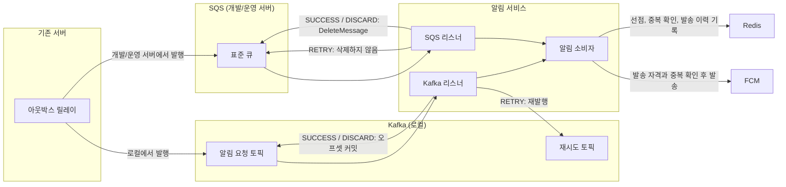

[앞 글](/posts/notification-sqs-visibility-redrive)에서는 마냑의 알림 소비자를 개발서버 SQS에 붙이고 자격 조회 실패로 DLQ에 간 메시지를 복구했다. 마냑은 사용자가 설정을 넣으면 AI가 스토리를 만들고 그 스토리 속 인물과 채팅하는 서비스다. 로컬 Kafka와 개발서버 SQS에 같은 소비 규칙을 적용했지만 완료와 재시도 방식은 달랐다.

이번에는 두 어댑터의 차이를 비교하고 개발서버에서 알림 중단과 처리 불가 메시지를 넣어 본 결과를 정리한다. 비동기로 바꾼 뒤 아웃박스 기록부터 알림 처리 결과까지 걸린 시간도 쟀다. 무부하 개발서버 트래픽 13건의 중앙값은 2.08초였고 운영 브로커로는 SQS 표준 큐를 골랐다.

환경은 이전과 같다.

| 항목 | 환경 |
| --- | --- |
| Java | 21 |
| Kotlin | 2.2.21 |
| Spring Boot | 4.0.6 |
| spring-kafka | 4.0.5 |
| Spring Cloud AWS | 4.1.1 |
| Redis | 7 |
| 로컬 브로커 | `apache/kafka:4.3.1` KRaft 단일 노드 |
| 개발/운영 서버 브로커 | SQS |

## 소비 규칙은 그대로 두고 어댑터를 둘로 나누기

[Kafka 소비 글](/posts/notification-kafka-idempotent-consumer)에서 공용 알림 소비자는 결과를 `SUCCESS`, `DISCARD`, `RETRY`로 나눴다. Redis에는 메시지 선점과 완료를 남기고 기기별 발송 성공도 따로 기록한다. 재전달이 와도 이미 보낸 기기는 건너뛴다.

발송 자격과 중복 여부를 판단하는 규칙은 브로커가 바뀌어도 같아야 했다. 그래서 두 리스너는 메시지를 읽어 공용 소비자에 넘기고 그 결과를 각 브로커의 완료와 재시도 방식에 맞추는 역할만 맡겼다. `RETRY`를 예외로 전달하는 데까지는 같고 그 뒤의 처리가 달라진다.

발행 쪽도 릴레이가 특정 브로커에 의존하지 않도록 분리했다. 로컬에서는 Kafka에 수신자 ID를 키로 보내고 개발/운영 서버에서는 SQS 표준 큐로 보내도록 어댑터만 바꾼다. 발송 요청을 보관하는 아웃박스와 중복 발송을 막는 Redis 처리는 그대로 쓴다.



## Kafka는 오프셋을 넘기고 SQS는 메시지를 삭제하기

Kafka에서는 메시지 처리를 마쳤거나 재시도할 곳으로 옮긴 뒤에만 원본 오프셋을 넘기기로 했다. 자동 커밋을 끄고 레코드마다 완료를 확인하며 `RETRY`가 나면 실패 메시지를 `.retry` 토픽에 발행한다. 재발행을 확인하지 못하면 원본 오프셋도 커밋하지 않아 요청이 사라지지 않게 했다.

리스너의 재시도 설정은 다음과 같다.

```kotlin
    @RetryableTopic(
        attempts = "\${manyak.push.consumer.retry-attempts:5}",
        backOff = BackOff(delayString = "\${manyak.push.consumer.retry-delay-ms:60000}"),
        retryTopicSuffix = ".retry", dltTopicSuffix = ".dlq",
        sameIntervalTopicReuseStrategy = SameIntervalTopicReuseStrategy.SINGLE_TOPIC,
        autoCreateTopics = "false", kafkaTemplate = "kafkaTemplate",
        include = [RetryMessageException::class],
    )
```

SQS에서는 처리를 마쳤거나 다시 시도할 필요가 없을 때만 메시지를 삭제한다. 리스너의 정상 종료를 완료로 보는 `ON_SUCCESS` 설정을 썼다. `RETRY` 예외가 나면 삭제하지 않고 가시성 타임아웃 60초 뒤 다시 받는다. 최초 수신을 포함해 5회 실패하면 큐의 재전달 정책이 DLQ로 옮긴다.

```kotlin
    @SqsListener(
        queueNames = ["\${manyak.push.queue-url}"],
        acknowledgementMode = "ON_SUCCESS",
        pollTimeoutSeconds = "20",
        maxConcurrentMessages = "2",
        maxMessagesPerPoll = "2",
    )
```

Kafka의 5회와 60초는 앱 애노테이션 설정이라 변경할 때 앱을 배포한다. SQS의 5회와 60초는 큐 설정이라 Terraform을 적용한다. 알림 앱에도 같은 값을 환경 변수로 전달한다. Redis 처리 중 키의 유효시간 120초가 재시도 창 `4 × 60초`보다 짧은지 기동 시 검사하기 때문이다. SQS에서는 재시도 설정을 바꿀 때 큐와 앱의 값을 함께 확인해야 한다.

## 처리 불가 메시지가 DLQ로 가는 시간

Kafka에서는 다시 시도할 여지가 있는 실패만 재시도 대상으로 삼았다. 공용 소비자의 `RETRY`를 예외로 바꾼 경우만 재시도 토픽으로 보내고 JSON 파싱이나 메시지 검증 실패는 곧장 `.dlq`로 보낸다. DLQ에 도착하면 카운터와 로그를 남긴다.

SQS에는 처리 불가 메시지를 곧장 DLQ로 보내는 설정이 없다. 직접 DLQ에 발행하면 권한과 코드 경로가 늘고 로그만 남긴 뒤 원본을 삭제하면 메시지를 잃는다. 직접 보내는 구현을 추가하지 않고 5회 수신을 감수했다. 파싱과 검증 실패는 Redis 선점과 FCM 호출 전에 발생하므로 반복 수신해도 푸시가 발송되지는 않는다. 대신 수신 요청을 다섯 번 쓰고 DLQ에 도착하기까지 약 5분이 걸린다.

SQS DLQ의 메시지는 `aws sqs start-message-move-task`로 본 큐에 다시 보낼 수 있다. 앞 글에서는 비어 있던 내부 공유 시크릿을 복구한 뒤 DLQ 1건을 옮겼고 같은 메시지 ID가 `SUCCESS`로 처리됐다. 이번에는 처리 불가 메시지가 실제로 DLQ에 가고 경보가 오는지 따로 확인했다.

## 순서와 병렬 처리의 기준도 달라지기

Kafka 발행은 수신자 ID를 키로 쓴다. 같은 키의 메시지는 파티션 안에서 순서를 따르고 컨슈머 그룹의 병렬 처리 상한은 파티션 수다. [로컬 실습](/posts/notification-kafka-idempotent-consumer)에서는 종료하지 않은 콘솔 컨슈머 3개가 `notification` 그룹으로 파티션 3개를 모두 맡아 새 알림 서비스가 네 번째 컨슈머로 대기했다.

SQS 표준 큐에는 그 메시지 키나 순서 보장이 없다. 알림은 순서가 필요 없어 표준 큐를 골랐고 중복 전달은 공용 Redis 저장소가 처리한다. SQS 리스너는 한 번에 메시지 두 개까지 처리하도록 제한했다. Kafka처럼 파티션을 나누어 소비자를 배정하지 않고 메시지를 받을 수 있는 소비자가 경쟁한다.

처리가 길어질 때도 기준이 다르다. Kafka는 다음 폴링까지 허용하는 시간을 960초로 뒀고 그 안에 다시 폴링하지 않으면 담당 파티션을 재배정하는 대상이 된다. SQS는 처리 상한 예산이 약 104초로 가시성 60초보다 길다. 처리 중 다시 받은 메시지는 Redis의 `BUSY` 또는 `DONE`이 처리한다. 처리 도중 가시성 제한 시간을 연장하지는 않았다.

발행 제한은 아웃박스 배치 제한 20초보다 짧게 뒀다. Kafka는 `acks=all`에 메타데이터 대기 최대 1초와 전송 제한 15초를 설정했다. SQS SDK는 호출 전체 10초와 개별 시도 5초로 제한했다. 한 배치의 발행이 20초를 넘으면 릴레이가 실패 행을 재시도한다.

적체를 볼 때 Kafka에서는 컨슈머 그룹 LAG를 보고 SQS에서는 수신 대기 중인 메시지 수와 가장 오래된 메시지의 대기 시간을 본다. Kafka 로컬 소비자의 폴링 대기는 250ms다. SQS는 20초 롱폴링을 쓰며 빈 큐에서 폴러 하나가 계속 기다리면 30일간 129,600회 요청으로 월 100만 요청 무료 구간의 약 13%다. 로컬 Kafka는 단일 노드로 띄웠고 MSK 비용은 조사하지 않아 금액으로 비교하지 않았다.

## 알림을 멈춘 동안 쌓인 메시지와 동의 철회

로컬 Kafka 실습에서는 알림 서비스를 멈추자 컨슈머 그룹 LAG가 1이 됐고 다시 띄운 지 8초 뒤 처리됐다. 서버를 멈춘 실습은 두 번 `RETRY`한 뒤 복구되어 세 번째에 완료됐으며 계속 멈춘 경우에는 정확히 5회 실패 후 DLQ로 갔다. 이때 재시도 간격은 실측 시간을 줄이려고 운영값 60초 대신 5초였다.

개발서버 SQS에서는 9월 27일 16:56 KST에 ECS exec로 알림 컨테이너의 Java 프로세스를 종료했다. 알림 컨테이너가 종료돼도 태스크 전체는 멈추지 않도록 설정해 서버, AI, DB 컨테이너는 `RUNNING`을 유지했다. 16:59에 개발서버 웹의 간편 제작 API가 27.9초 뒤 201을 반환했고 본 큐에 메시지 1건이 보였다.

적체 중 사용자가 서비스 알림 동의를 껐다. 17:00에 알림을 재기동했지만 같은 태스크에서 알림이 서버보다 먼저 떠 내부 발송 자격 조회에 실패했다. 17:03:24와 17:04:21에 `ELIGIBILITY_UNAVAILABLE`로 `RETRY`했다.

17:05:22에는 자격 조회가 200으로 끝나고 소비 결과가 `DISCARD/SERVICE_PUSH_DISABLED`가 됐다. 메시지는 삭제됐고 푸시는 오지 않았으며 본 큐와 DLQ도 0건이었다. 큐에 넣을 때 동의를 확정하지 않고 발송할 때 다시 확인했으므로 적체 중 철회한 상태가 반영됐다. 60초 재시도는 재기동 직후의 자격 조회 실패도 넘겼다.

## 처리 불가 메시지 다섯 번과 DLQ 경보

처음에는 FCM 키를 바꿔 실패를 만들려 했다. 그러나 FCM 401과 403은 `DISCARD`로 끝나므로 DLQ에 가지 않는다. FCM 키 JSON을 파손하면 기동에 실패해 DLQ 도달을 보장하지 못했다. 필수 필드가 빠진 메시지를 직접 큐에 보내 검증 예외를 일으켰다.

17:40:07부터 17:44:07까지 60초 간격으로 5회 처리에 실패했고 삭제되지 않은 메시지는 17:45에 DLQ로 이동했다. DLQ에는 1건이 보였다. 17:47:13에 경보가 울리고 이메일이 왔다.

18:13에 DLQ 메시지의 본문이 테스트용 처리 불가 메시지인지 확인했다. DLQ에서 본 수신 횟수는 6이었다. 이 메시지는 다시 보내지 않고 삭제했으며 18:19:13에 경보가 OK로 돌아오고 복구 이메일이 왔다.

Kafka에서는 설정상 파싱 실패가 곧장 `.dlq`로 간다. 이번 개발서버 장애 주입에서 확인한 것은 SQS가 검증 예외 메시지를 5회 받은 뒤 DLQ로 옮긴 결과다. 앞 글의 시크릿 사고는 `RETRY` 경로였고 이번에는 검증 예외 경로였다.

## 동기 발송에서 아웃박스와 큐로 바꾼 대가

서버 안에서 직접 보내던 경로는 스토리 완료 트랜잭션이 커밋된 뒤 실행기로 푸시를 보낸다. 실행기가 포화하면 버리고 서버가 재시작되어도 완료 이벤트는 다시 오지 않는다. 한때 사용한 동기 HTTP 경로는 알림 서비스가 내려가면 호출에 실패했다.

현재 아웃박스 경로는 완료 상태와 아웃박스 행을 같은 트랜잭션에 기록한다. 릴레이가 행을 브로커로 보내고 소비자는 Redis 멱등 처리를 거쳐 FCM을 호출한다. 알림 서비스가 내려가면 SQS에 메시지가 쌓였다가 다시 소비된다.

| 경로 | 실패와 재전달 | 완료 뒤 알림 지연 |
| --- | --- | --- |
| 서버 내부 발송 | 실행기 포화나 재시작 시 유실, 최대 한 번 | 커밋 직후와 FCM 처리 시간의 합, 실측 없음 |
| 동기 HTTP | 알림 서비스 다운 시 호출 실패, 최대 한 번 | HTTP 왕복과 FCM 처리 시간의 합, 실측 없음 |
| 아웃박스와 SQS | 아웃박스에 남기고 최소 한 번 전달, Redis로 중복 발송 방지 | 개발서버 13건의 중앙값 2.08초 |

아웃박스 경로에는 DB 테이블, 릴레이, 큐, DLQ, 경보, Redis가 들어간다. 발송 요청을 아웃박스에 남겨 유실을 막고 재시도도 가능하게 한 대신 움직이는 구성 요소가 늘었다. 지연도 동기 경로와 같은 조건에서 비교한 값이 없어 코드상의 예상과 개발서버 비동기 실측을 구분해야 한다.

## 개발서버에서 14건의 발행과 13건의 처리 지연 측정

9월 27일부터 28일까지 개발서버 아웃박스 14행의 생성 시각과 발행 완료 기록 시각을 알림 컨테이너의 `큐 알림 처리 결과` 로그와 대조했다. 같은 메시지 ID끼리 연결해 발송 요청을 남긴 뒤 처리 결과가 나오기까지의 시간을 구했다. 스토리 완성 3건과 검수 결과 11건으로 측정용 메시지를 따로 넣지 않은 무부하 개발서버 트래픽이다. DB와 알림은 같은 Fargate 태스크의 컨테이너였다.

알림 중단 실험으로 적체된 1건은 평상시 처리 지연 통계에서 제외했다. 나머지 13건에서 아웃박스 기록부터 첫 알림 처리 결과 로그까지의 중앙값은 2.08초였다.

| 측정 구간 | 건수 | 중앙값 | 범위 |
| --- | ---: | ---: | ---: |
| 아웃박스 기록부터 발행 완료 기록 | 14 | 1.72초 | 0.56~4.14초 |
| 아웃박스 기록부터 알림 처리 결과 로그 | 13 | 2.08초 | 0.60~3.83초 |

동의를 꺼서 `DISCARD`한 처리는 약 0.04초였고 자격 조회와 FCM을 거친 처리는 1.2~2.1초였다. 릴레이는 한 차례 조회를 마친 뒤 2초를 기다렸다가 DB를 다시 조회한다. 행이 생기면 다음 조회까지 기다려야 하므로 평상시 지연의 많은 부분이 릴레이 폴링에서 생겼다. SQS의 20초 롱폴링은 메시지가 오면 바로 응답하므로 그 20초가 발송 지연에 더해지는 것은 아니다.

릴레이는 배치 전체 발행을 기다린 뒤 DB에 결과를 적는다. 따라서 DB의 발행 완료 시각은 개별 메시지를 브로커가 받은 시각보다 늦을 수 있다. 08:38:11~12에 가까운 시각으로 기록된 3건은 알림 처리 로그가 발행 완료 기록보다 0.2~0.4초 먼저 남았다. 그래서 발행 완료 기록까지의 시간은 상한으로 읽고 전체 처리 지연은 아웃박스 생성 시각과 알림 처리 결과 로그로 계산했다.

장애 중에는 재시도와 적체가 시간을 늘렸다. 알림 중단 실험의 첫 처리는 아웃박스 기록에서 246초 뒤였고 최종 결과까지는 364초가 걸렸다. 앞 글의 시크릿 사고는 5회 실패와 DLQ 수동 재처리를 거쳐 최종 결과까지 약 863초였다. 동기 HTTP 경로는 이미 제거되어 같은 조건의 지연을 실측하지 못했다.

## 운영 적용 전 점검

이 수치는 개발서버의 무부하 표본 13건에서 나온 중앙값이다. 부하가 걸렸을 때의 발행 지연이나 동기 HTTP와의 실제 차이를 뜻하지 않는다. 릴레이의 폴링 간격을 줄이면 대기 시간을 줄일 수 있지만 빈 DB 조회도 늘어난다. 간격 변경은 아직 결정하지 않았다.

개발서버에서는 서버와 알림이 한 ECS 태스크에 있어 태스크 역할도 공유한다. 운영에서는 알림을 별도 서비스로 분리하고 서비스별 IAM을 정하는 작업이 남아 있다. 본 큐 적체 경보도 개발서버에서 임계값 근거가 부족해 보류했다. 적체 1건이 5분 지표에서 10초로 잡혔기 때문이다. 운영 설계에서 다시 판단할 항목이다.

SQS 재시도 시간과 횟수는 큐와 알림 환경 변수에 모두 들어간다. 어느 한쪽만 바꾸면 Redis 선점 유효시간과 재시도 창의 관계가 달라질 수 있다. 처리 예산 104초가 가시성 60초보다 긴 경우도 별도 실측하지 않았으므로 Redis의 `BUSY`와 `DONE` 처리를 전제로 운영 상태를 확인해야 한다.

## 정리

Kafka는 실패 메시지를 재시도 토픽으로 옮기고 SQS는 삭제하지 않은 메시지를 가시성 타임아웃 뒤 다시 준다. 공용 소비자와 Redis 멱등 저장소는 같아도 재시도와 DLQ의 설정 위치, 처리 불가 메시지가 DLQ에 도착하는 시간, 병렬 처리 기준은 달랐다.

개발서버에서는 알림이 멈춘 동안 쌓인 메시지가 재기동 뒤 소비됐고 그사이 철회한 알림 동의가 발송 시점에 반영됐다. 처리 불가 메시지도 5회 실패 뒤 DLQ로 이동해 경보가 왔다. 평상시 비동기 지연의 중앙값 2.08초 중 많은 부분은 2초 간격의 아웃박스 조회에서 생겼다. 다음에는 운영에서 알림을 별도 서비스로 나누고 권한과 관측 항목을 정한다.
