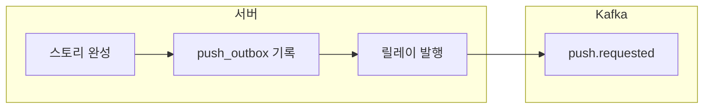

마냑은 사용자가 설정을 넣으면 AI가 스토리를 만들고 그 스토리 속 인물과 채팅하는 서비스이고 [앞 글](/posts/notification-service-sync-extraction)에서는 알림 서비스를 동기 HTTP로 분리했다. 다만 알림 서비스가 꺼져 있거나 서버의 실행기 큐가 차면 스토리 완성 푸시를 버렸다.

이번에는 스토리 완성과 같은 트랜잭션에 발송 요청을 남기고 릴레이가 Kafka의 `push.requested`로 옮기게 바꿨다. 브로커를 멈춰도 스토리 완성 API는 정상 응답했고 아웃박스에 남은 요청은 복구 뒤 발행됐다. 대신 같은 메시지가 Kafka에 두 번 들어갈 수 있다는 한계도 확인했다.

서버에서 Kafka까지의 경로는 다음과 같다.



확인한 환경은 Java 21, Kotlin 2.2.21, Spring Boot 4.0.6, spring-kafka 4.0.5, PostgreSQL 16이다. 로컬 브로커는 `apache/kafka:4.3.1` 이미지의 KRaft 단일 노드를 썼다.

## 스토리 완성과 발송 요청을 함께 저장하기

DB 커밋 뒤 Kafka에 바로 쓰면 커밋과 발행 사이에서 서버가 죽을 때 푸시가 사라진다. 순서를 바꿔 Kafka에 먼저 쓴 뒤 DB를 커밋하면 스토리 완성에 실패해도 알림만 나가는 경우가 생긴다. 두 저장소를 한 트랜잭션으로 묶을 수 없으므로 PostgreSQL 안에서 스토리 완성과 발송 요청을 먼저 원자적으로 저장했다.

기존 `onCompleted` 훅은 요청 행을 `COMPLETED`로 바꾸는 트랜잭션 안에서 실행되고 있었다. 관련 부분만 줄이면 리스너는 그 트랜잭션 참여를 강제하고 `push_outbox`에 메시지를 넣는다.

```kotlin
    @EventListener
    @Transactional(propagation = Propagation.MANDATORY)
    fun onStoryCompleted(event: StoryCompletedEvent) {
        val user = users.findById(event.userId).orElseThrow()
        store.insert(PushMessage(
            messageId = "story-completed:${event.requestId}",
            recipientId = user.publicId.toString(),
            data = mapOf("type" to "STORY_COMPLETED", "storyId" to event.storyPublicId, "title" to event.title,
                "deepLink" to "${webBaseUrl.trimEnd('/')}/stories/${event.storyPublicId}"),
            requestId = MDC.get("request_id") ?: "unknown",
            sessionId = MDC.get("session_id") ?: "unknown",
        ), clock.instant())
    }
```

`PushOutboxStore.insert`도 `MANDATORY`라 트랜잭션 밖에서 호출하면 실패한다. 아웃박스 기록에 실패하면 스토리 완성도 함께 롤백된다.

```kotlin
    @Transactional(propagation = Propagation.MANDATORY)
    fun insert(message: PushMessage, now: Instant) {
        jdbc.update("""
            INSERT INTO push_outbox(message_id, payload, status, attempts, next_attempt_at, created_at)
            VALUES (?, CAST(? AS jsonb), 'PENDING', 0, ?, ?)
            ON CONFLICT (message_id) DO NOTHING
        """.trimIndent(), message.messageId, mapper.writeValueAsString(message), Timestamp.from(now), Timestamp.from(now))
    }
```

메시지 ID는 `story-completed:{requestId}`이고 DB에도 `UNIQUE` 제약이 있다. 같은 완성 요청이 다시 들어오면 기존 스토리를 반환하는 replay 경로로 빠져 이 리스너에 오지 않지만 저장소에서도 같은 메시지를 한 번 더 만들지 않는다. E2E에서 같은 `requestId`로 재요청했을 때 응답의 스토리 ID는 같았고 아웃박스 행은 1건으로 유지됐다.

## 여러 릴레이가 겹쳐도 한 행만 선점하기

릴레이는 보낼 때마다 `PENDING` 행을 가져온다. 운영 배포 중에는 새 태스크가 뜬 뒤 기존 태스크가 내려가므로 잠깐 두 릴레이가 함께 돈다. 단순 조회 뒤 상태를 바꾸면 두 릴레이가 같은 행을 보낼 수 있다.

조회에는 `FOR UPDATE SKIP LOCKED`를 썼다. 한 릴레이가 잠근 행은 다른 릴레이가 기다리지 않고 건너뛴다. 같은 짧은 트랜잭션에서 `next_attempt_at`을 60초 뒤로 옮긴 다음 커밋하고 Kafka 전송은 트랜잭션 밖에서 시작한다.

```kotlin
        val rows = jdbc.query("""
            SELECT id, payload, attempts, created_at FROM push_outbox
            WHERE status = 'PENDING' AND next_attempt_at <= ?
            ORDER BY id LIMIT ? FOR UPDATE SKIP LOCKED
        """.trimIndent(), { rs, _ ->
            PushOutboxRow(rs.getLong("id"), mapper.readValue(rs.getString("payload"), PushMessage::class.java),
                rs.getInt("attempts"), rs.getTimestamp("created_at").toInstant(), until)
        }, Timestamp.from(now), batchSize)
        rows.forEach { jdbc.update("UPDATE push_outbox SET next_attempt_at = ? WHERE id = ?", Timestamp.from(until), it.id) }
```

별도의 `PUBLISHING` 상태는 만들지 않았다. `next_attempt_at` 하나가 평소에는 다음 재시도 시각이고 전송 중에는 임대 만료 시각이다. 릴레이가 발행 도중 죽으면 60초 뒤 다른 릴레이가 다시 가져간다. 결과를 저장할 때도 선점 당시의 시각과 DB의 `next_attempt_at`이 같은지 비교하므로 임대가 끝난 이전 작업이 새 작업의 결과를 덮지 못한다.

시간 제한은 안쪽부터 바깥쪽으로 길어지게 정했다.

```text
Kafka 메타데이터 대기 1초 + delivery timeout 15초
< 릴레이 배치 제한 20초
< 아웃박스 임대 60초
```

한 건씩 최대 15초를 기다리면 배치 크기만큼 시간이 늘어나 임대를 넘을 수 있다. 릴레이는 배치의 전송을 모두 시작한 뒤 전체 결과를 한꺼번에 기다린다. 브로커 장애가 20초 가까이 이어져도 다른 정기 작업을 늦추지 않도록 릴레이에는 전용 단일 스레드 스케줄러도 붙였다. 기존 기본 스케줄러는 스레드 하나를 다른 `@Scheduled` 작업 8개와 나눠 쓰고 있었다.

## 브로커 장애에서 확인한 중복 발행

전송 실패 뒤에는 5초부터 두 배씩 늘려 최대 5분까지 기다린다. 포기 기준은 횟수가 아니라 아웃박스 행을 만든 뒤 24시간이다. 5초 간격으로 5번 같은 횟수 상한을 두면 한 시간짜리 브로커 장애에서도 25초 만에 모두 포기해 아웃박스를 둔 의미가 없어진다. 반대로 하루가 지난 스토리 완성 알림은 더 보내지 않기로 했다.

Kafka 컨테이너를 `docker pause`한 채 스토리를 완성했을 때 API는 36ms 만에 201을 반환했고 아웃박스 행은 `PENDING`으로 남았다. 실패 시점을 기준으로 5초, 10초, 20초, 40초 백오프가 적용됐으며 `attempts`는 4까지 늘었다. 컨테이너를 다시 실행한 뒤 약 15초가 지나자 행은 `PUBLISHED`가 됐다.

예상하지 못한 결과는 토픽에 같은 `messageId`가 2건 들어간 일이었다. 첫 전송은 15초가 지나 타임아웃으로 끝났지만 브로커 쪽 연결에는 메시지가 이미 실려 있었다. Kafka가 다시 움직이면서 그 메시지를 처리했고 릴레이도 다음 재시도에서 같은 메시지를 보냈다.

발행자는 실패로 봤는데 실제로는 도착한 경우다. 발행 성공과 아웃박스 완료 기록 사이에서도 서버가 죽을 수 있으므로 같은 문제는 남는다. 아웃박스는 유실을 막지만 단일 발행을 보장하지 않는다.

## 서버 쪽 운영 적용 전 점검

현재 구현이 기록하는 아웃박스 지표는 `published`, `retry`, `abandoned` 발행 결과 카운터다. 운영에서는 이 카운터와 함께 오래된 `PENDING` 수, 가장 오래된 행의 나이, `FAILED` 행 수를 지켜봐야 하는데 뒤의 세 값은 아직 지표로 구현하지 않았다.

로컬 Kafka는 단일 노드라 브로커 디스크 장애까지 버티지 못한다. 이번 E2E는 프로세스 중단과 네트워크 대기에서 서버와 릴레이가 어떻게 움직이는지 확인한 것이고 브로커 자체의 고가용성을 검증한 것은 아니다.

## 정리

스토리 완성과 발송 요청을 한 트랜잭션에 묶자 브로커가 멈춰도 사용자 요청은 정상 처리됐고 발송 요청은 DB에 남았다. 릴레이는 임대와 백오프로 장애 뒤 발행을 이어 갔다.

아웃박스는 유실은 막지만 중복 발행은 남는다. [다음 글](/posts/notification-kafka-idempotent-consumer)에서는 소비자가 그 중복을 받아낸다.
